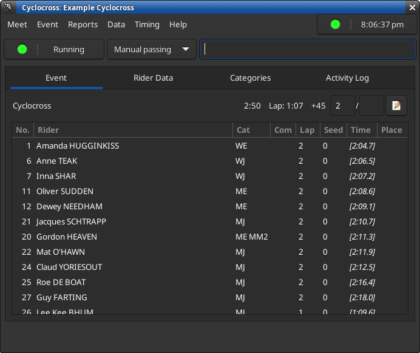

# metarace-roadmeet

Timing and result application for UCI Part 2 Road Races,
UCI Part 5 Cyclo-Cross, criterium, road handicap and
ad-hoc time trial events.

## Usage

Create a new meet and open it:

	$ roadmeet

Open an existing road meet:

	$ roadmeet PATH

Edit default configuration:

	$ roadmeet --edit-default

## Support

   - Signal Group: [metarace](https://signal.group/#CjQKII2j2E7Zxn7dHgsazfKlrIXfhjgZOUB3OUFhzKyb-p_bEhBehsI65MhGABZaJeJ-tMZl)
   - Github Issues: [issues](https://github.com/ndf-zz/metarace-roadmeet/issues)

## Requirements

   - Python >= 3.9
   - PyGObject
   - Gtk >= 3.0
   - metarace > 2.1
   - tex-gyre fonts (optional, recommended)
   - evince (optional, recommended)
   - rsync (optional)
   - mosquitto (optional)

## Automated Installation

For semi-automated installation on common unix-like
desktop systems, download the [install script](install.sh)
and run with sh:

	$ sh install.sh

## Manual Installation

Install system requirements for your OS (See
[System-Specific Preparation](#system-specific-preparaton)
below) then prepare a metarace runtime directory
and virtual env as follows:

	$ mkdir -p ~/Documents/metarace
	$ python3 -m venv --system-site-packages ~/Documents/metarace/venv

Install roadmeet to the virtual env, or run from
source using one of the following methods:

### Install From PyPI With Pip

Use pip in your virtual env to download and install
roadmeet from the Python Package Index:

	$ ~/Documents/metarace/venv/bin/pip3 install metarace-roadmeet

Create a new empty roadmeet:

	$ ~/Documents/metarace/venv/bin/roadmeet

### Install From Wheel

Download the roadmeet wheel from github and verify signature:

	$ wget https://github.com/ndf-zz/metarace-roadmeet/releases/download/v1.13.3/metarace_roadmeet-1.13.3-py3-none-any.whl
	$ wget https://github.com/ndf-zz/metarace-roadmeet/releases/download/v1.13.3/metarace_roadmeet-1.13.3-py3-none-any.whl.asc
	$ gpg --verify metarace_roadmeet-1.13.3-py3-none-any.whl.asc

Use pip in your virtual env to install the roadmeet wheel:

	$ ~/Documents/metarace/venv/bin/pip3 install ./metarace_roadmeet-1.13.2-py3-none-any.whl

Create a new empty roadmeet:

	$ ~/Documents/metarace/venv/bin/roadmeet

### Run From Source Tree

Activate the virtual env, optionally install
any required libraries, clone the repository
and run roadmeet directly:

	$ source ~/Documents/metarace/venv/bin/activate
	(venv) $ pip3 install metarace
	(venv) $ git clone https://github.com/ndf-zz/metarace-roadmeet.git
	(venv) $ cd metarace-roadmeet/src
	(venv) $ python3 -m roadmeet

## Post-Installation Notes

Run roadmeet once to initialise a metarace shared configuration:

	$ ~/Documents/metarace/venv/bin/roadmeet

Optionally configure defaults for new meets and library options:

	$ ~/Documents/metarace/venv/bin/roadmeet --edit-default

### Gnome Desktop

By default, Gnome uses a system font which does not have
fixed-width digits. As a result, rolling times displayed
in roadmeet will jiggle left and right as the digits change,
and right-aligned time columns will not align correctly
at the decimal point.

To correct this, install gnome-tweaks and change the
system font to one with fixed-width digits eg:
Noto Sans Regular.

### XFCE

The XFCE default window manager uses function keys to switch
workspaces, rendering them inaccessible to roadmeet.
To use these function keys in roadmeet (eg for
reports, arming and reset), first clear the relevant
window manager shortcuts.

Under Settings, Window Manager, Keyboard, locate the
"Workspace N" entries and clear the shortcut for each one by
selecting the "Clear" button.

Roadmeet can be configured to open meet folders in Thunar
by creating a custom action with appearance conditions 
set to include "Directories". The action can then be
added to the toolbar or triggered from a context menu.

Following an automated install, you may need to log out
and back in for the menu entries to be properly updated.

## System-Specific Preparation

### Debian 11+, Ubuntu, Mint (apt)

Install system requirements for roadmeet and metarace with apt:

	$ sudo apt install python3-venv python3-pip
	$ sudo apt install python3-cairo python3-gi python3-gi-cairo
	$ sudo apt install gir1.2-gtk-3.0 gir1.2-rsvg-2.0 gir1.2-pango-1.0
	$ sudo apt install python3-serial python3-paho-mqtt python3-dateutil python3-xlwt

Optionally add fonts, PDF viewer, rsync and MQTT broker:

	$ sudo apt install fonts-texgyre fonts-noto evince rsync mosquitto

If using an Alge Timy, Tag Heuer decoder or Race Result
USB active extension, add your user to the group dialout in
order to access serial ports:

	$ sudo gpasswd -a "$USER" dialout

### Arch, Manjaro, EndeavourOS (pacman)

Install system requirements with pacman:

	$ sudo pacman -S --needed python python-pip gtk3
	$ sudo pacman -S --needed python-pyserial python-dateutil python-xlwt python-paho-mqtt python-gobject python-cairo

Optionally install pdf viewer, fonts, rsync and mqtt broker:

	$ sudo pacman -S --needed noto-fonts tex-gyre-fonts evince rsync mosquitto
	$ sudo systemctl enable mosquitto.service

If using an Alge Timy, Tag Heuer decoder or Race Result
USB active extension, add your user to the group uucp in
order to access serial ports:

	$ sudo gpasswd -a "$USER" uucp

### Gentoo Linux

Install required system libraries, or select a
suitable meta-package. For example, XFCE:

	# emerge --ask -n xfce-base/xfce4-meta x11-themes/gnome-themes-standard

Install required python packages:

	# emerge --ask -n dev-libs/gobject-introspection dev-python/pygobject dev-python/python-dateutil dev-python/xlwt dev-python/pyserial dev-python/paho-mqtt

Install optional fonts, pdf viewer and MQTT broker:

	# emerge --ask -n media-fonts/tex-gyre media-fonts/noto app-text/evince app-misc/mosquitto net-misc/rsync

If using an Alge Timy, Tag Heuer decoder or Race Result
USB active extension, add your user to the group dialout in
order to access serial ports:

	# gpasswd -a "username" dialout

### Alpine Linux (apk)

[todo]

### Fedora Linux (dnf)

Install system requirements:

	$ sudo dnf install gtk3 gobject-introspection cairo-gobject
	$ sudo dnf install python3-pip python3-cairo
	$ sudo dnf install python3-pyserial python3-paho-mqtt python3-dateutil python-xlwt

Optionally add fonts, PDF viewer, rsync and MQTT broker:

	$ sudo dnf install google-noto-sans-fonts google-noto-mono-fonts google-noto-emoji-fonts texlive-tex-gyre evince rsync mosquitto
	$ sudo systemctl enable mosquitto.service

If using an Alge Timy, Tag Heuer decoder or Race Result
USB active extension, add your user to the group dialout in
order to access serial ports:

	$ sudo gpasswd -a "$USER" dialout

### MacOS / Brew

*Untested*

Install system requirements:

	$ brew install python@3.11 gtk+3 librsvg pygobject3

Add optional pdf viewer and mqtt broker:

	$ brew install evince rsync mosquitto

Fetch and install Tex-Gyre OTF fonts from Gust:

	https://www.gust.org.pl/projects/e-foundry/tex-gyre/whole/tg2_501otf.zip

### Windows / MSYS2 (pacman)

[todo]
