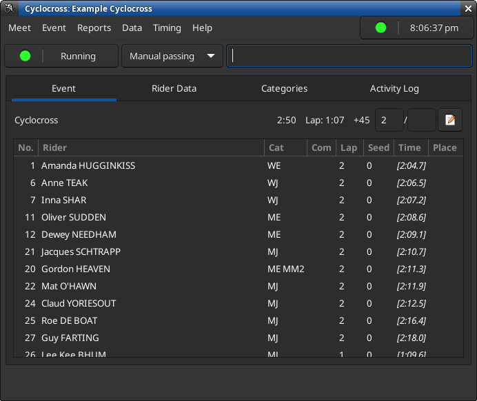

# metarace-roadmeet

Archived: 2026-05-14
Moved to: https://codeberg.org/ndf-zz/metarace-roadmeet

Timing and result application for road races,
cyclocross, criterium, road handicap and
ad-hoc time trial events.

## Usage

Choose meet folder and open:

	$ roadmeet

Open an existing road meet:

	$ roadmeet PATH

Create empty meet folder and open it:

	$ roadmeet --create

Edit default configuration:

	$ roadmeet --edit-default

## Standards

Category standards for Australian domestic road meets are
provided at the following URL:

[https://6-v.org/au/](https://6-v.org/au/)

To enable standard category imports, check the source urls in
Meet->Properties->Standards, then import to the current meet
via Data->Update Standards.

## Time Trial Timing Modes & Options

### Impulse (Classic)

Chronometer impulses on channels C0 (start) and C1 (finish)
determine rider's elapsed time in the event.

Hardware setup:

   - Tape switch or photo cell on start line connected to chronometer C0
   - Tape switch or photo cell on finish line connected to chronometer C1
   - Transponder loop ~10m before finish line

Meet configuration:

   - Hardware -> Transponders: Decoder type/port [optional]
   - Hardware -> Impulse: Timy serial port

OR

   - Telegraph -> Timer: timertopic
   - Telegraph -> Receive remote timer messages? Yes

Event configuration:

   - Autotime: Match impulses to transponder? No
   - Start Loop: null
   - Finish Loop: null
   - Finish Loop: Map trigger to start? No
   - Start: Start times are strict? [optional]

In this mode, transponder readings will arm the finish line
for arrival of a finishing rider.

The start line can be manually operated, or if the "strict start"
option is set, start impulses will be automatically applied.

### Transponder

Rider finish times are determined by transponder passings
and start times are set by advertised start or transponder passing.

Hardware setup:

   - Transponder loop on finish line
   - Transponder loop just after start line (may also be finish line)

Meet configuration:

   - Hardware -> Transponders: Decoder type/port
   - Hardware -> Impulse: null

OR

   - Telegraph -> Timer: timertopic
   - Telegraph -> Receive remote timer messages? Yes

Event configuration:

   - Autotime: Match impulses to transponder? No
   - Start Loop: 1-8 [optional]
   - Finish Loop: 1-8
   - Finish Loop: Map trigger to start? No
   - Start: Start times are strict? [optional]

**Note:** In this mode, precision is limited to 0.1s due
to hardware limitations and variation in transponder placement.

If strict start times are enabled, rider start times will
be set by transponder passing only when within ~5s of the
advertised start time.

The start and finish loops can be the same, for the case
where starters cross the finish loop as they depart the
start area.

### Autotime Transponder + Impulse

Start and finish times are set by chronometer impulses,
matched automatically to a corresponding transponder
passing.

Hardware setup:

   - Tape switch or photo cell on start line connected to chronometer C0
   - Tape switch or photo cell on finish line connected to chronometer C1
   - Transponder loop on finish line
   - Optional transponder loop just after start line (may also be finish line)

Meet configuration:

   - Hardware -> Transponders: Decoder type/port
   - Hardware -> Impulse: Timy serial port

OR

   - Telegraph -> Timer: timertopic
   - Telegraph -> Receive remote timer messages? Yes

Event configuration:

   - Autotime: Match impulses to transponder? Yes
   - Start Loop: 1-8 [optional, may be same as finish]
   - Finish Loop: 1-8
   - Finish Loop: Map trigger to start? No
   - Start: Start times are strict? [Depends on start loop]

If start loop is set, strict start mode should be disabled.
If start loop is null, strict start should be enabled.

**Note:** In autotime mode, transponder passings must be received
after chronometer impulses. When using Tag Heuer/Chronelec
transponders, enable the "Detect Max" option to delay transponder
passings long enough to collect impulses first.

### Hybrid (Impulse start/transponder finish)

Hybrid mode is a special-case where a decoder's impulse trigger
input is used to supply a start time and transponder
readings are used on the finish line. This mode is especially useful
when a sterile finish line cannot be guaranteed, for short
time gaps or when riders complete a number of laps through a shared
finish.

Hardware setup:

   - tape switch or photocell on start line - connected to decoder's
     impulse input
   - transponder loop on finish line

Meet configuration:

   - Hardware -> Transponders: Decoder type/port
   - Hardware -> Impulse: null

OR

   - Telegraph -> Timer: timertopic
   - Telegraph -> Receive remote timer messages? Yes

Event configuration:

   - Autotime: Match impulses to transponder? No
   - Start Loop: null
   - Finish Loop: 1-8
   - Finish Loop: Map trigger to start? Yes
   - Start: Start times are strict? Yes

**Note:** In hybrid mode, a strict startlist is required to
allocate start impulses to starting riders automatically. If
strict start is not enabled, start line must be manually operated.

## Support

   - Signal Group: [metarace](https://signal.group/#CjQKII2j2E7Zxn7dHgsazfKlrIXfhjgZOUB3OUFhzKyb-p_bEhBehsI65MhGABZaJeJ-tMZl)
   - Issues: [issues](https://codeberg.org/ndf-zz/metarace-roadmeet/issues)

## Requirements

   - Python >= 3.11
   - PyGObject
   - Gtk >= 3.22
   - metarace >= 2.1.25
   - tex-gyre fonts (optional, recommended)
   - evince (optional, recommended)
   - rsync (optional)
   - mosquitto (optional)

## Post-Installation Notes

Optionally configure defaults for new meets and library options:

        $ ~/Documents/metarace/venv/bin/roadmeet --edit-default

### KDE/Plasma (Wayland)

KDE Plasma will incorrectly mask
function key modifiers, rendering roadmeet action
keys unusable. The workaround is to remove any keyboard shortcuts
for Fn or Ctrl+Fn keys in Settings - Keyboard - Shortcuts.

Debugging messages are sent to the systemd journal,
view with journalctl:

        $ journalctl -f

### Gnome Desktop (Wayland/X11)

By default, Gnome uses a system font which does not have
fixed-width digits. As a result, rolling times displayed
in roadmeet will jiggle left and right as the digits change,
and right-aligned time columns will not align correctly
at the decimal point.

To correct this, install gnome-tweaks and change the
system font to one with fixed-width digits eg:
Noto Sans Regular.

Debugging messages are sent to the systemd journal,
view with journalctl:

        $ journalctl -f

### XFCE4/labwc (Wayland)

Remove any `C-Fn` or `Fn` key mappings from the Labwc
configuration file `~/.config/xfce4/labwc/rc.xml` under
`<keyboard><keybind key=...>` elements.

Debugging messages are appended to ~/.xsession-errors,
view with tail:

        $ tail -f ~/.xsession-errors

### XFCE4 (X11)

Under Settings, Window Manager, Keyboard, locate the
"Workspace N" entries and clear the shortcuts for each one by
selecting the "Clear" button.

Debugging messages are appended to ~/.xsession-errors,
view with tail:

        $ tail -f ~/.xsession-errors

## Manual Installation

Install system requirements for your OS
then prepare a metarace runtime directory
and virtual env as follows:

        $ mkdir -p ~/Documents/metarace
        $ python3 -m venv --system-site-packages ~/Documents/metarace/venv

Use pip in your virtual env to download and install
roadmeet along with any required python packages
from the Python Package Index:

        $ ~/Documents/metarace/venv/bin/pip3 install metarace-roadmeet

Create a new empty roadmeet:

        $ ~/Documents/metarace/venv/bin/roadmeet --create

